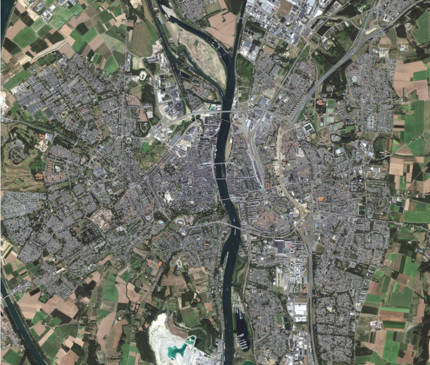

# Workshop satellietbeelden

Workshop gegeven door Tim Croux en Merel te Hofste 

## Stap 1: Satellietbeelden opknippen 
Als eerste hebben we de satellietdata gedownload van Maastricht. Vervolgens deze omgezet naar een afbeeldingsformaat (*.TIFF). Deze afbeelding opgeknipt naar kleinere tegels van 1000x1000 pixels.

Hieronder de code die hiervoor gebruikt is:

```import os, gdal

in_path =r"PATH/Maastricht.tif"

out_path = r"PATH/tile_"

tile_size_x = 10000
tile_size_y = 10000

ds = gdal.Open(in_path)
band = ds.GetRasterBand(1)
xsize = band.XSize
ysize = band.YSize

for i in range(0, xsize, tile_size_x):
   for j in range(0, ysize, tile_size_y):
        com_string = "gdal_translate -of GTIFF -srcwin " + str(i)+ ", " + str(j) + ", " + str(tile_size_x) + ", " + str(tile_size_y) + " " + str(in_path) + " " + str(out_path) + str(i) + "_" + str(j) + ".tif"
        os.system(com_string)```
        
Input  Maastricht afbeelding in TIFF.



Output Tegels van 1000x1000 in TIFF.


## Stap 2: NWB shape omzetten naar tif file


## Stap 3: Rotondes op satellietbeelden herkennen met een eerder getraind model
